# Bottle Opener Design and FEA Optimization

This repository presents the mechanical design, 3D modeling, and structural analysis of a custom bottle opener. Developed as a team project by a group of three engineering students for our university coursework, this project covers the full engineering cycle: from functional geometric definition and CAD modeling in SolidWorks, to Finite Element Analysis (FEA) using ANSYS APDL, and final physical destructive testing.

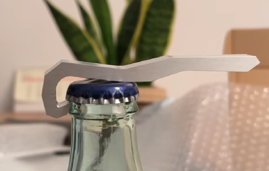

*Final Bottle Opener Design*

### 1\. 3D Modeling and Design Iterations

The geometric parameters were meticulously defined based on the standard dimensions of a crown cap. The 3D modeling was executed using SolidWorks, evolving through several iterations. Rapid prototyping with 3D printed PLA was utilized to validate the ergonomics and the mechanical fit before committing to the final shape.

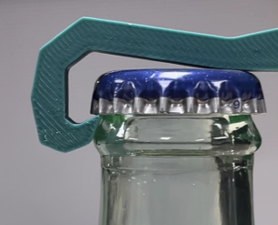

*PLA Prototype Fitting Test*

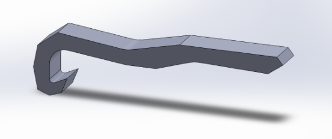

*Final 3D Model of the Bottle Opener*

### 2\. Finite Element Analysis (FEA)

To guarantee the structural integrity of the opener under maximum loads and ensure it wouldn't fail before the bottle cap yields, a 2D plane stress analysis was conducted using ANSYS APDL.

#### Material Selection and Boundary Conditions

The chosen material for the final product was Aluminum 6061-T6, selected for its excellent balance of yield strength, low density, and high machinability. The boundary conditions simulated the real-world lever action: a fixed support at the cap's center, an upward reaction force at the cap's edge, and an applied load at the handle.

#### Meshing and Refinement

An intelligent mesh was initially applied to the geometry. To ensure the reliability of our results without incurring excessive computational costs, we applied localized mesh refinement around the main stress concentrators—specifically the inner radii in direct contact with the bottle cap.

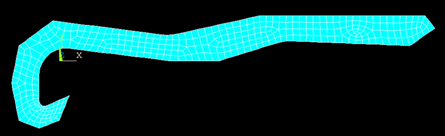

*Initial Intelligent Mesh*

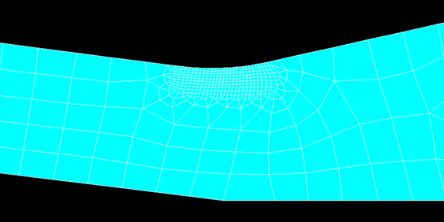

*Localized Mesh Refinement at the Critical Point*

#### Stress and Displacement Results

The simulation evaluated both the nominal force required to open a standard bottle and the ultimate force before material failure.

<table>

&#x20; <tbody>

&#x20;   <tr>

&#x20;     <td>Fnom (N)</td>

&#x20;     <td>93.58</td>

&#x20;   </tr>

&#x20;   <tr>

&#x20;     <td>Fultimate (N)</td>

&#x20;     <td>140.37 < F < 187.16</td>

&#x20;   </tr>

&#x20; </tbody>

</table>

*Nominal and ultimate forces values*

<table>

&#x20; <tr>

&#x20;   <td align="center">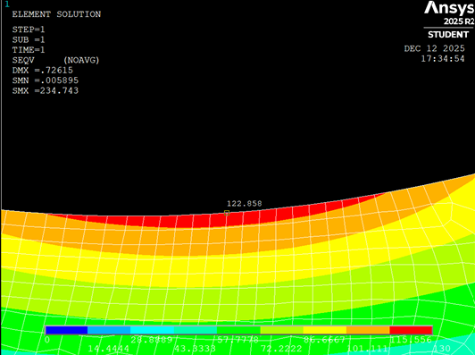</td>

&#x20;   <td align="center">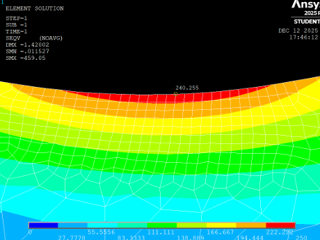</td>

&#x20; </tr>

&#x20; <tr>

&#x20;   <td align="center"><em>Von Mises Equivalent Stress on Critical Point under **Nominal Force**</em></td>

&#x20;   <td align="center"><em>Von Mises Equivalent Stress on Critical Point under **Ultimate Force**</em></td>

&#x20; </tr>

</table>

<table>

&#x20; <tr>

&#x20;   <td align="center">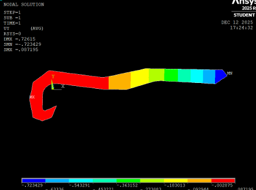</td>

&#x20;   <td align="center">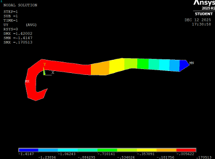</td>

&#x20; </tr>

&#x20; <tr>

&#x20;   <td align="center"><em>Vertical Displacement under **Nominal Force**</em></td>

&#x20;   <td align="center"><em>Vertical Displacement under **Ultimate Force**</em></td>

&#x20; </tr>

</table>

### 3\. Design Optimization (Material Reduction)

To optimize manufacturing costs and reduce weight, a material reduction study was conducted. A hole was introduced into the handle design, and the entire FEA was recalculated. We verified that the new stress concentrations generated by the hole did not compromise the established safety factors.

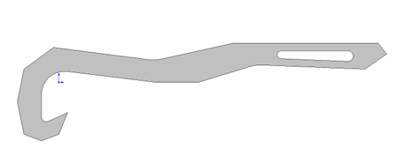

*Optimized Design featuring Material Reduction*

### 4\. Manufacturing Process

The final optimized design was manufactured via Computer Numerical Control (CNC) machining using Aluminum 6061-T6. To ensure cost-effectiveness, the machining was outsourced to a supplier in China (JLC CNC). The total cost amounted to €30.82, which included both the manufacturing and shipping processes. The finished physical part was received in 20 days.

*Technical specifications of the command*

### 5\. Experimental Correlation and Destructive Testing

Finally, the CNC-machined part was subjected to both functional and destructive testing (plastic deformation) in the laboratory. The physical testing allowed us to observe the real-world fracture mechanics and correlate the experimental ultimate force with the theoretical predictions from our ANSYS simulations.

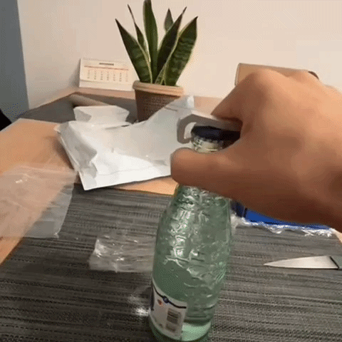

*Functional test*

*Destructive testing procedure of the bottle opener*

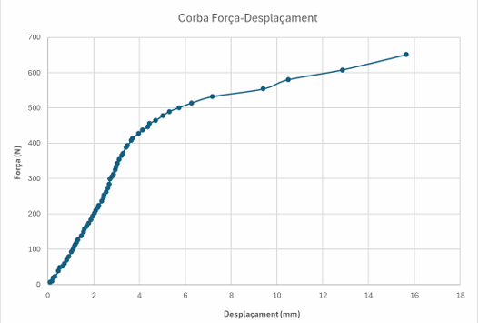

*Force-Displacement curve collected during destructive test*

<table>

&#x20; <thead>

&#x20;   <tr>

&#x20;     <th>Parameter</th>

&#x20;     <th>Theoretical</th>

&#x20;     <th>Experimental</th>

&#x20;   </tr>

&#x20; </thead>

&#x20; <tbody>

&#x20;   <tr>

&#x20;     <td>Mass (g) m</td>

&#x20;     <td>14.56</td>

&#x20;     <td>14.44</td>

&#x20;   </tr>

&#x20;   <tr>

&#x20;     <td>Ultimate force (N) Fu</td>

&#x20;     <td>183</td>

&#x20;     <td>354</td>

&#x20;   </tr>

&#x20;   <tr>

&#x20;     <td>Efficiency ζ</td>

&#x20;     <td>1281.21</td>

&#x20;     <td>2501.55</td>

&#x20;   </tr>

&#x20;   <tr>

&#x20;     <td>Safety factor γs</td>

&#x20;     <td>1.96</td>

&#x20;     <td>3.78</td>

&#x20;   </tr>

&#x20; </tbody>

</table>

*Comparison of theoretical and experimental data*

When analyzing the results, it can be observed that the experimental ultimate force (354 N) is surprisingly higher than the theoretical one (183 N). To a large extent, this happened because we had to send the design for manufacturing before being able to conclude the in-depth FEA study; in retrospect, the material thickness should have been smaller to truly optimize the part.

In addition to this design factor, the report's own conclusions detail the technical reasons for this major discrepancy:

* In the ANSYS simulation, a point force and a point fulcrum were assumed, which are assumptions that differ substantially from reality.
* ANSYS determines the onset of plastic deformation when an almost infinitesimal point adopts the yield strength stress, but in the real test, a higher force is required for this deformation to become noticeable.
* The displacement was measured from the right end of the handle. This point is not only affected by the critical zone, but also by the rest of the points on the handle that continue to have an elastic (and therefore linear) behavior at higher forces, even when the critical zone has already entered the plastic regime.

